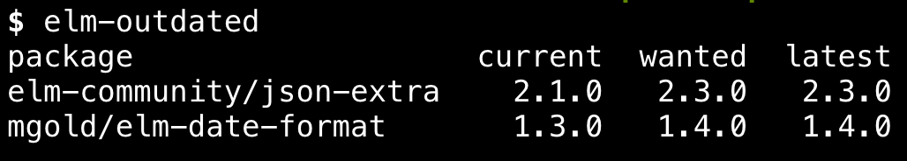

# elm-outdated

Small tool to help you keep your Elm dependencies up-to-date. Inspired by `npm outdated`.

### Installation

```
npm i -g elm-outdated
```

### Usage

Just run `elm-outdated` in your project directory where `elm.json` or `elm-package.json` is located.

### Example


